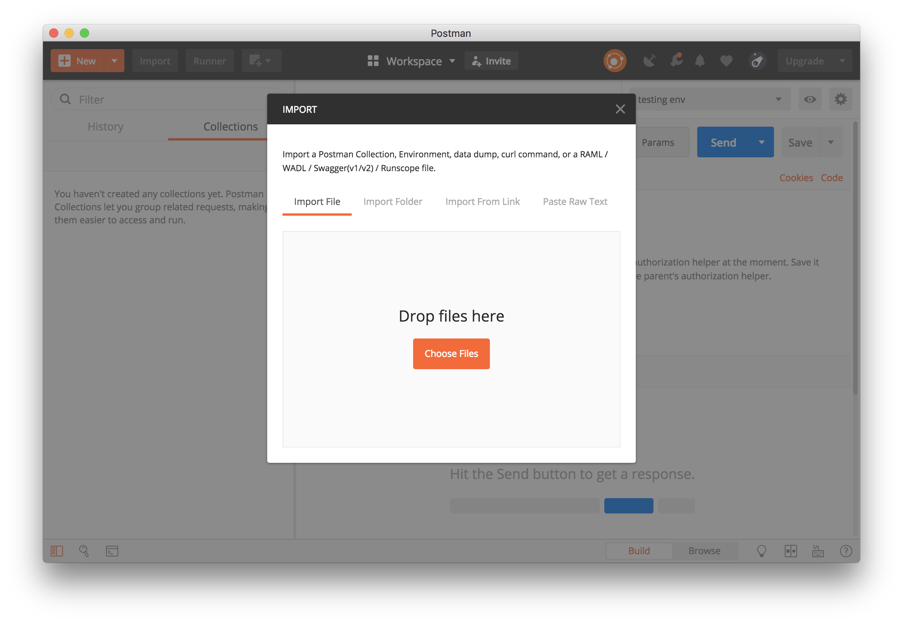

:github-readme: ../README.adoc

include::{github-readme}[tags=vardef]

:projectpage: https://github.com/{gh-repo-owner}/{gh-repo-name}

include::{github-readme}[tags=header]

== URLs

* link:{homepage}[Project home] (this page)
* link:{projectpage}[GitHub project]
* link:{talkpage}[Session page] on the EclipseCon website
* link:{issues}[Issue tracker]

TIP: Do you want to improve this page? Please git-link:self[edit it on GitHub, edit].

include::{github-readme}[tags=description]

=== OpenAPI specification

The git-link:OpenAPI-Spec/[OpenAPI-Spec] folder contains the OpenAPI specification for the Todo-Application.

Open it in Swagger-Editor online:

* link:https://editor.swagger.io/?url=https://raw.githubusercontent.com/{gh-repo-owner}/{gh-repo-name}/master/OpenAPI-Spec/todo-backend.yaml[`todo-backend.yaml`]

=== Postman collection

The postman collection can be found here: git-link:Postman/todo-backend.postman_collection.json[`Postman/todo-backend.postman_collection.json`]

You can get the same result if you import the git-link:OpenAPI-Spec/todo-backend.yaml[`todo-backend.yaml`] file into Postman.

=== Server implementation

include::../todo-backend/README.adoc[tags="content", leveloffset=1]

=== Client implementation

The OpenAPI-Generator jar is prepared in the git-link:todoapp_client/[todoapp_client] folder.

include::../todoapp_client/README.adoc[]

== Talks

include::{github-readme}[tags=talks]

include::{github-readme}[tags=contact-section]

include::{github-readme}[tags=license-section]
